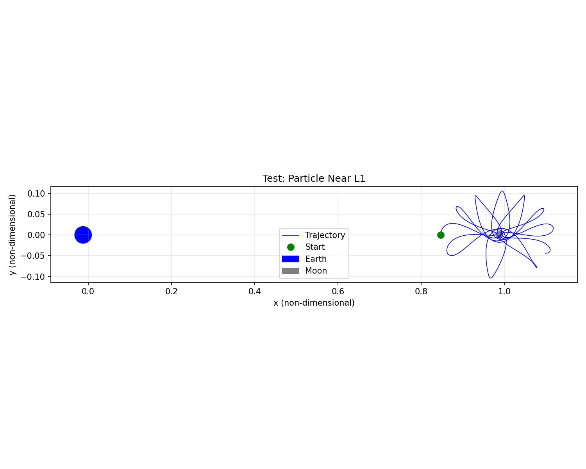

# Cislunar SSA

Open-source cislunar orbit propagator for space situational awareness.



## What This Is

A Python toolkit for modeling spacecraft and debris trajectories in the Earth-Moon system using the Circular Restricted Three-Body Problem (CR3BP).

## Physics

- CR3BP equations of motion
- Lagrange point computation
- Jacobi integral and zero-velocity surfaces
- Trajectory propagation and visualization

## Install

```bash
pip install -r requirements.txt
from physics import compute_lagrange_points, propagate
import numpy as np

L = compute_lagrange_points()
state0 = [L['L1'][0] + 0.01, 0.0, 0.0, 0.0, 0.1, 0.0]
t_eval = np.linspace(0, 10, 1000)
sol = propagate(state0, (0, 10), t_eval)

**Commit and push:**

```bash
git add .
git commit -m "Add trajectory visualization to README"
git push origin main
cat > notebooks/01_cr3bp_basics.ipynb << 'EOF'
{
 "cells": [
  {
   "cell_type": "markdown",
   "metadata": {},
   "source": [
    "# CR3BP Basics: Lagrange Points and Trajectories\n",
    "\n",
    "Demonstration of the Circular Restricted Three-Body Problem for the Earth-Moon system."
   ]
  },
  {
   "cell_type": "code",
   "execution_count": null,
   "metadata": {},
   "outputs": [],
   "source": [
    "import sys\n",
    "sys.path.insert(0, '../src')\n",
    "\n",
    "import numpy as np\n",
    "import matplotlib.pyplot as plt\n",
    "from physics import compute_lagrange_points, propagate, jacobi_integral\n",
    "from viz.rotating_frame import plot_trajectory"
   ]
  },
  {
   "cell_type": "markdown",
   "metadata": {},
   "source": [
    "## 1. Compute Lagrange Points"
   ]
  },
  {
   "cell_type": "code",
   "execution_count": null,
   "metadata": {},
   "outputs": [],
   "source": [
    "L = compute_lagrange_points()\n",
    "
git add .
git commit -m "Add Jupyter notebook demo for CR3BP basics"
git push origin main
cat > src/debris/catalog.py << 'EOF'
"""Synthetic debris catalog for cislunar space."""

import numpy as np

def generate_debris_catalog(n_objects=100, region='cislunar', seed=None):
    """
    Generate synthetic debris population.
    
    Parameters:
        n_objects: number of debris objects
        region: 'cislunar', 'leo', or 'geo'
        seed: random seed for reproducibility
    Returns:
        dict with keys: id, state (x,y,z,vx,vy,vz), size, epoch
    """
    if seed is not None:
        np.random.seed(seed)
    
    if region == 'cislunar':
        # Between Earth and Moon, roughly
        x = np.random.uniform(-1.5, 1.5, n_objects)
        y = np.random.uniform(-1.5, 1.5, n_objects)
        z = np.random.uniform(-0.5, 0.5, n_objects)
        vx = np.random.normal(0, 0.1, n_objects)
        vy = np.random.normal(0, 0.1, n_objects)
        vz = np.random.normal(0, 0.05, n_objects)
    else:
        raise NotImplementedError(f"Region '{region}' not yet implemented")
    
    sizes = np.random.lognormal(-2, 1, n_objects)  # meters, roughly
    
    catalog = {
        'id': np.arange(n_objects),
        'state': np.column_stack([x, y, z, vx, vy, vz]),
        'size': sizes,
        'epoch': 0.0
    }
    return catalog

def catalog_to_propagator_states(catalog):
    """Convert catalog states to list for propagator."""
    return [state for state in catalog['state']]
